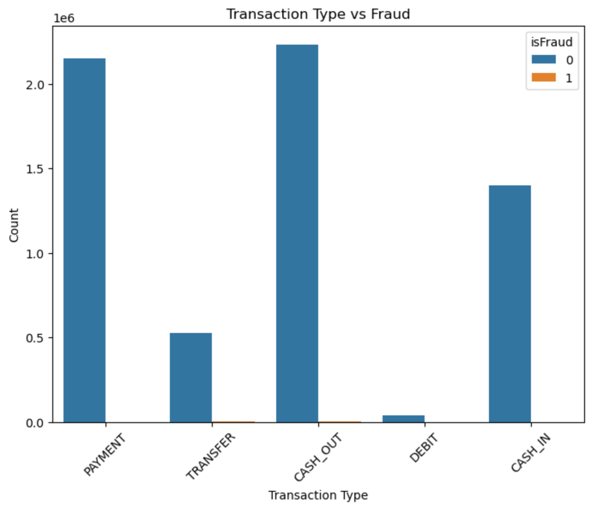
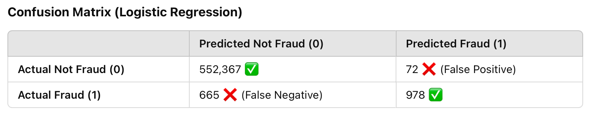
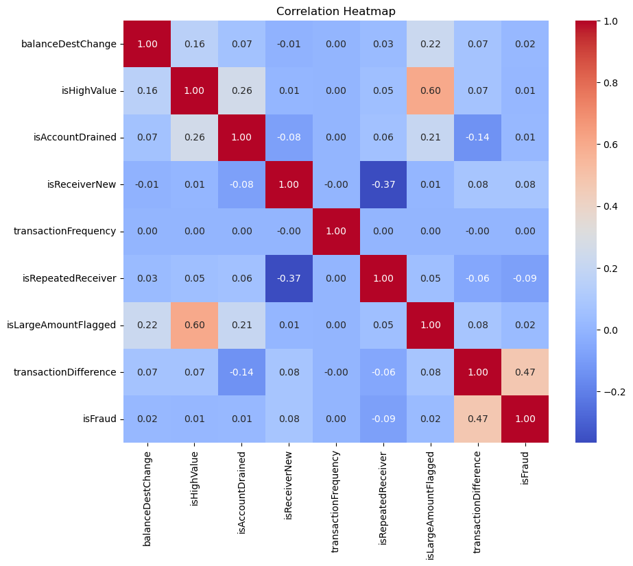

# Fraud Detection Model

## Project Overview  

### Project Overview  

This project focused on building a fraud detection model using a dataset of financial transactions. The goal was to accurately identify fraudulent activity while minimizing false positives and false negatives. Since fraud cases were rare in this dataset compared to legitimate transactions, it was important to handle the major class imbalance effectively.  

The data was cleaned and preprocessed, and initial modeling was done using a **Logistic Regressor**. While **Support Vector Machine (SVM)** was considered, it was found to be inefficient for this task. The next step involves completing the **Random Forest model**, which appears to be the most suitable approach for detecting fraudulent transactions. By the end of the project, the goal is to have a robust fraud detection system that can reliably flag suspicious transactions for further review better than the current model. 

## Dataset Description

The dataset includes the following features:  

**Step:** Represents time in hours since the start of data collection  

**Type:** Type of transaction (e.g., CASH-IN, CASH-OUT, TRANSFER, etc.)  

**Amount:** Transaction amount  

**NameOrig:** The ID of the origin account   

**OldBalanceOrg:** Balance of the origin account before the transaction   

**NewBalanceOrg:** Balance of the origin account after the transaction   

**NameDest** The ID of the destination account   

**OldBalanceDest:** Balance of the destination account before the transaction   

**NewBalanceDest:** Balance of the destination account after the transaction   

**IsFlaggedFraud:** A rule-based flag for transactions greater than 200,000   
 
**IsFraud:** Indicates whether the transaction was actually fraudulent   

## Objectives

**Understand Key Features:** Explore the relationships between transaction details and fraud occurrences to create better fraud detection 

**Feature Engineering:** Generate new features such as balance discrepancies and transaction frequency('step')  

**Data Visualization:** Use plots to identify key relevant features and patterns in fraudulent transactions  

**Machine Learning Modeling:** Address class imbalance, train and evaluate models to predict fraud more accurately   

### Key Indicators of Fraud 

**Transaction Type:**

- Fraud is mostly found in "TRANSFER" and "CASH_OUT" transactions involving moving money between accounts.
- Transactions like "DEBIT", "PAYMENT", and "CASH_IN" are most likely not malignant. 

**Balance Changes:**
- The sender's (NameOrig) OldBalanceOrg is higher, but the NewBalanceOrg is suspiciously 0, meaning they transferred all their funds out
- The receiver's (NameDest) OldBalanceDest is 0 or unusually low, meaning it could be a newly created fraudulent account  

**Large Amounts:**
- Fraudulent transactions often involve large amounts being transferred quickly (step)
- The IsFlaggedFraud column may flag a transaction if it exceeds 200,000, but actual fraud can occur below this threshold- it's not clear what currency this is solely from the data so context is important  

**Destination Account Behavior:**
- If the destination account (NameDest) is frequently receiving large sums and quickly cashing out, it might be part of a fraud network
- May see the same accounts used multiple times or completely new accounts ($0 balance) to launder money  

**Repeated Transactions in a Short Time:**
- If multiple transactions occur within a short time from the same NameOrig, it could indicate an account being drained  

 

## Model Development

## **Model Selection**
Evaluate logistic regression, decision trees, random forests  

- **Evaluation Metrics:** Precision, recall, F1-score, and AUC-ROC to assess model performance.

## 1. Hypothesis Formulation & Exploratory Data Analysis (EDA)

### Hypothesis:
- Fraudulent transactions show distinct patterns related to amount, balance changes, and transaction type ( e.g large transfers outside of the origin)
- The destination account balance may behave differently in fraud cases (e.g more frequently across multiple origins)
- Certain transaction types (e.g., cash-outs, transfers) may be more fraud-prone.
- Large transactions might be flagged as fraud more frequently, but not all large transactions are fraudulent

### EDA & Initial Insights
- Box Plots & Log Scale Transformations
The dataset contains a wide range of transaction amounts, making it necessary to use log transformation for better visualization.
Outliers are prevalent in legitimate transactions, as expected.

- Feature Correlation
Variables like OldbalanceDest and NewbalanceDest may contain fraud-specific patterns.
Fraudulent transactions often involve unexpected balance shifts after a transaction.

## 2. Data Cleaning & Preprocessing

**Key Preprocessing Steps** 
✅ Categorical variables encoded using One-Hot Encoding  
✅ Dropped redundant features to streamline model interpretation of relevant features 

**Preprocessing:**  
- Handle missing values and data inconsistencies   

- Use One Hot Encoding to encode categorical variables (e.g., transaction types)  

- Handle Class Imbalance (Fraudulent Cases are minority class)  

### Addressing Class Imbalance
The dataset has a severe imbalance:
552,439 legitimate transactions (Class 0)
1,643 fraud transactions (Class 1)
The model is at risk of favoring non-fraud predictions, missing actual fraud cases.
Resampling techniques (Oversampling fraud cases via SMOTE and undersampling the majority class) were applied.

## Feature Engineering 
**Use of correlation map to determine most relevant features to predict fraud:**

**Balance Discrepancy:**

- Compute Expected New Balance and compare it to NewBalanceOrg and NewBalanceDest.

- Formula: Expected New Balance = Old Balance - Amount. 

**Transaction Frequency:**

Count transactions per account within a given time window. 

**Anomaly Detection:**

Identify unusually large or frequent transactions.  

**Exploratory Data Analysis (EDA)** 

Correlation Analysis: Check relationships between numerical features and fraud occurrence.  

Pair Plots: Visualize interactions between multiple numerical features. 

Box Plots & Histograms: Examine distributions of transaction amounts and balances. 
 

## 3. Model Generation & Evaluation

**Logistic Regression Model (Baseline)***
- Precision (Fraud = 0.93) → The model correctly predicts fraud 93% of the time   
- Recall (Fraud = 0.60) → The model only catches 60% of real fraud cases, meaning 40% of fraud cases are missed  
- F1-score (Fraud = 0.73) → The imbalance affects recall, lowering the F1-score  

🔴 False Negatives (missed fraud cases) = 665 → A major issue  
🟢 False Positives (legitimate transactions wrongly flagged) = 72 → Relatively low  

**Confusion Matrix (Logistic Regression)**

Goal: Improve fraud detection using a non-linear decision boundary  
Evaluation Plan:
- Precision, Recall, F1-score comparison with Logistic Regression  
- ROC-AUC Curve to assess model performance.  

SVM may not be ideal- runs too slow and can not finish computing in time  

### Planned: Random Forest Model
- Handles class imbalance well and can model complex relationships between features much quicker with large amounts of data 
- Provides feature importance insights 

### Next Steps:
- Train a Random Forest model and compare its precision, recall, and F1-score to previous models
- Evaluate feature importance to identify the most critical fraud indicators

## 4. Conclusion & Next Steps

✅ EDA confirmed key fraud patterns, especially in transaction type and balance shifts  
✅ Logistic Regression performed well in precision but struggled with recall, needs to be tweaked a bit using sampling methods  
- SVM model is pending evaluation – expected to improve fraud detection  
- Random Forest will be tested for feature importance & better fraud detection  

**Future Work:**
- Optimize threshold tuning to balance precision and recall
- Complete detail analysis report using multiple models to compare, noting feature importance and sampling technique to adress class imbalance and create a good balance of recall and accuracy 
